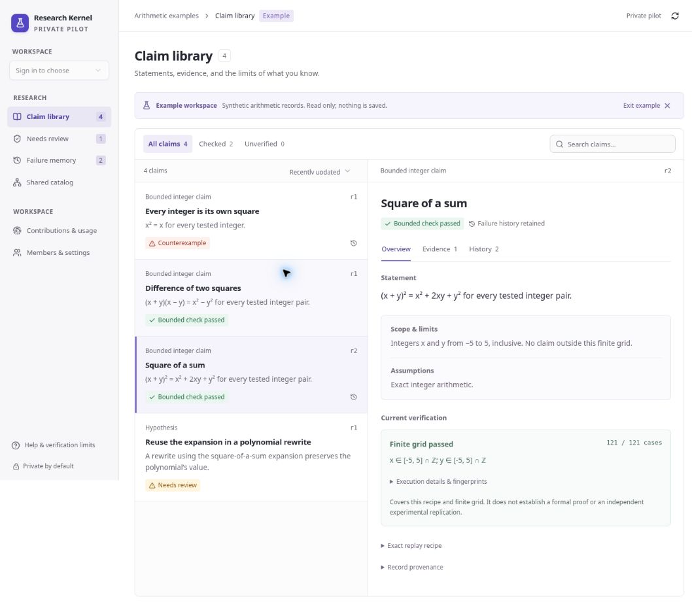

# Research Kernel UX redesign

Research and implementation date: 2026-10-01. Audience: researchers and small research teams inspecting persistent claims and evidence.

## Reference products

These are interaction references, not copied brands or an assertion that their growth was caused by their UI. Adoption figures below are vendor-reported, with their original dates retained.

| Product | Evidence of adoption / relevance | Pattern applied to Research Kernel |
| --- | --- | --- |
| [Linear](https://linear.app/now/sharing-growth-with-the-people-building-linear) | Reports more than 40,000 paying companies. Its [2024 redesign account](https://linear.app/now/how-we-redesigned-the-linear-ui) and [later design refresh](https://linear.app/now/behind-the-latest-design-refresh) explain the rationale for calmer navigation and consistent layouts. | Quiet sidebar; compact page headings; search and view controls in stable locations; content dominates the screen. |
| [Elicit](https://elicit.com/) | Reports use by more than five million researchers. Its [systematic-review product](https://elicit.com/solutions/systematic-review) keeps extraction and synthesis connected to supporting sources. | Statement, scope, and current receipt remain close together. Source evidence and execution evidence are separately labeled. |
| [Notion](https://www.notion.com/blog/100-million-of-you) | Reported reaching 100 million users in August 2024; this is historical, not a current user count. Its [view documentation](https://www.notion.com/help/views-filters-and-sorts) describes alternate filtered views over the same underlying records. | Claim library, Needs review, and Failure memory are views of the same records. Counts, search, and sorting support retrieval without duplicating data. |
| [Zotero](https://www.zotero.org/support/quick_start_guide) | A close research-library analogue; no adoption figure is asserted here. | Library navigation, a record list, and a detail inspector. On small screens, move between list and record rather than compressing both columns. |

## UX principles and resulting decisions

- **Progressive disclosure.** [Nielsen Norman Group](https://www.nngroup.com/articles/progressive-disclosure/) recommends exposing primary controls first and deferring infrequent or advanced choices. Overview, Evidence, and History tabs separate reading tasks. Recipe JSON, execution environment, and SHA-256 fingerprints remain available in disclosures.
- **Recognition over recall.** [NN/g's explanation](https://www.nngroup.com/articles/recognition-and-recall/) supports visible cues and available options. Named statuses, explicit counts, visible scope, and the review notice help users understand a record without remembering a previous session.
- **Accessible interaction and reflow.** [WCAG 2.2 target-size guidance](https://www.w3.org/WAI/WCAG22/Understanding/target-size-minimum.html) and [reflow guidance](https://www.w3.org/WAI/WCAG22/Understanding/reflow.html) informed larger controls, visible focus, keyboard tabs, mobile navigation, and wrapping content. This pass is not a formal accessibility certification.
- **Honest system state.** A bounded check must remain a bounded check. Color is accompanied by text and an icon. The record always preserves its finite scope. An old counterexample appears under the exact revision it tested.

## Audit findings addressed

The previous shell gave prominent space to a slogan, explanatory prose, and four large counters even when no workspace existed. The record inspector was comparatively narrow, and receipts, provenance, evidence, and history shared one long column with little hierarchy. Navigation and key actions had inconsistent emphasis.

The redesign introduces a restrained neutral-and-indigo workbench, compact headings, a searchable claim list, an expanded inspector, separate review and failure views, distinct empty/search/loading states, and responsive navigation. Operational body text is 14–16px, with smaller secondary metadata. Research actions remain on the claim they affect. Secondary service and membership controls stay in workspace navigation.

The signed-out and new-workspace states explain one next step and offer a read-only arithmetic example. The example is explicitly synthetic and never saved. Its receipts are generated by the existing functional core, including a failed first revision and a corrected finite check. It does not imitate live customer research, adoption, or revenue.

## Validation

- TypeScript check passed; 29 hosted tests passed, including independent replay of each teaching-example receipt.
- Desktop browser review: sign-in/empty state, populated library, inspector, current result, preserved counterexample in History, search with no matches, reset, and Needs review view.
- Responsive browser review in 390px and 320px iframe viewports: onboarding, populated inspector, back to list, drawer navigation, and Failure memory. At the narrow viewport, document scroll width matched client width (305px after the scrollbar).
- Fixed a status-badge style collision, weak secondary text contrast, the primary link-button text color, and narrow filter wrapping during visual review.
- Existing permission, revision, persistence, MCP, and atomic commit tests continue to pass. No verification authority, sharing audience, or billing behavior changes.
- The development browser is not authenticated as the owner. Real-account claim writes, invitations, and backup downloads were not browser-tested in this pass. Those paths retain their existing server contracts and automated coverage.

## Next customer research

This design is an evidence-informed hypothesis. In pilot sessions, ask researchers to find a prior failed approach, explain a result's exact scope, identify a changed dependency, and locate the receipt for a particular revision. Observe task completion, time to locate evidence, incorrect interpretations of status, and requests for help. Use those observations to prioritize the next iteration; do not infer usability from visual polish alone.
